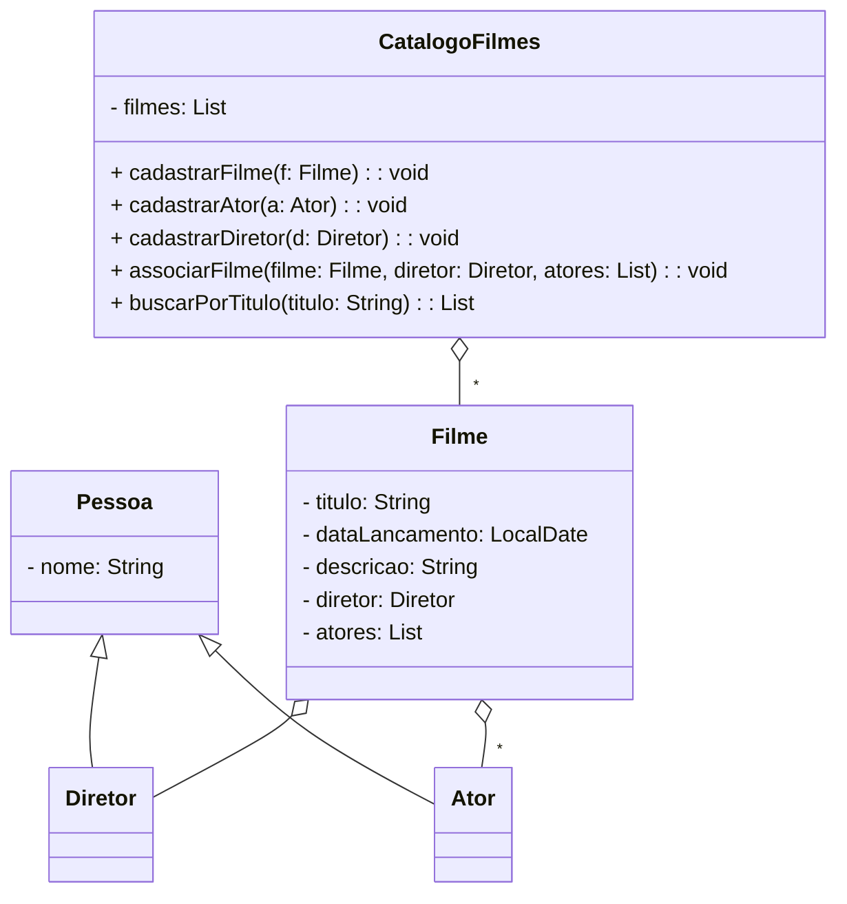

# ADAProjetoFinal
Um Projeto final para o curso da ADA

## Diagrama de Classes

```mermaid
classDiagram
    class Pessoa {
        - nome: String
    }
    class Diretor {
    }
    class Ator {
    }
    class Filme {
        - titulo: String
        - dataLancamento: LocalDate
        - descricao: String
        - diretor: Diretor
        - atores: List<Ator>
    }
    class CatalogoFilmes {
        - filmes: List<Filme>
        + cadastrarFilme(f: Filme): void
        + cadastrarAtor(a: Ator): void
        + cadastrarDiretor(d: Diretor): void
        + associarFilme(filme: Filme, diretor: Diretor, atores: List<Ator>): void
        + buscarPorTitulo(titulo: String): List<Filme>
    }
    Pessoa <|-- Diretor
    Pessoa <|-- Ator
    Filme o-- Diretor
    Filme o-- "*" Ator
    CatalogoFilmes o-- "*" Filme
```

Este diagrama representa as principais classes e relacionamentos do projeto.
